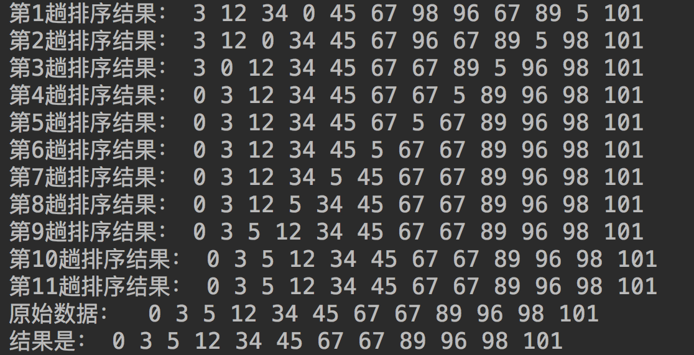
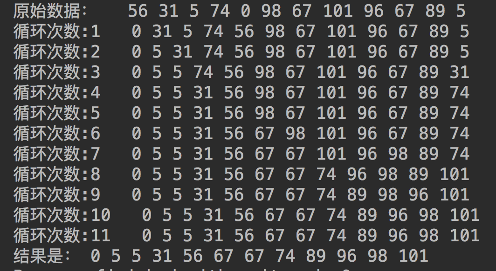
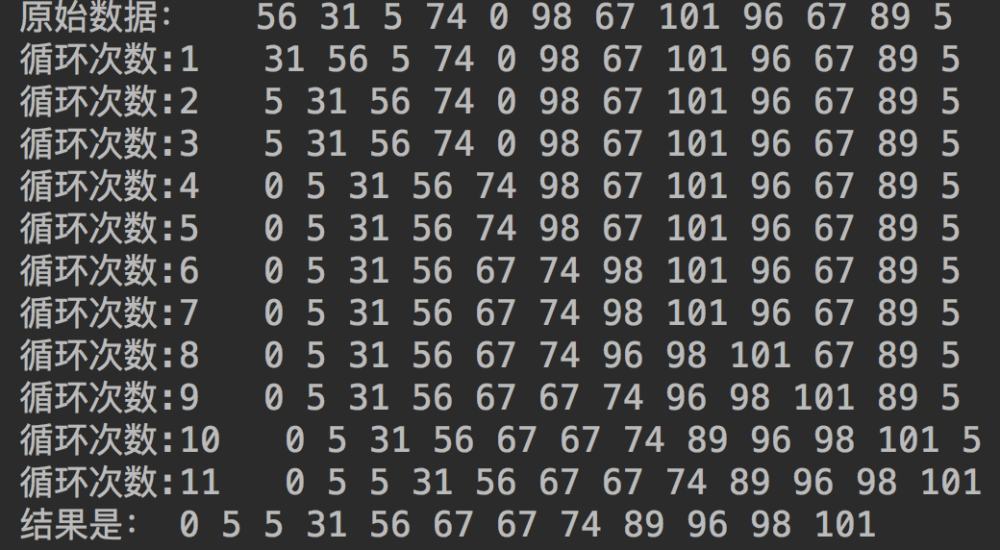

# 数据结构与算法实战

## 1 排序
### 1.1 [冒泡排序](./sort/BubbleSort.java) 

### 1.2 [选择排序](./sort/SelectionSort.java)

### 1.3 [插入排序](./sort/InsertionSorting.java)

## 2 Leetcode刷题
### 2.1 两数相加  
给定一个整数数组 nums 和一个目标值 target，请你在该数组中找出和为目标值的那 两个 整数，并返回他们的数组下标。  
你可以假设每种输入只会对应一个答案。但是，你不能重复利用这个数组中同样的元素。  
示例:  
给定 nums = [2, 7, 11, 15], target = 9  
因为 nums[0] + nums[1] = 2 + 7 = 9  
所以返回 [0, 1]  
[两数相加](./src/cn/luohua96/leetcode/Question1.java)
### 2.21 两个有序单链表合并
[两个有序单链表合并](./src/cn/luohua96/leetcode/Question21.java)
